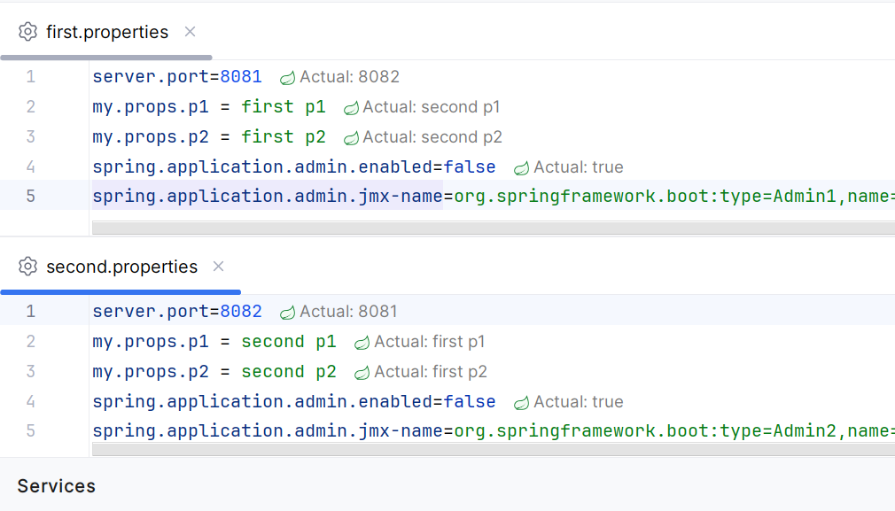

# The sibling contexts

we have 1 parent context and 2 sibling contexts that have their own configuration properties
Both siblings are web contexts and run on different ports.
Actuator is enabled.

Problems:

Actuator tabs:
only 1 set is displayed (i.e. i get the actuator information for one of the contexts only)
(Mappings, Environment tabs)
the default path link for the application node in services is also one of possible ones

https://youtrack.jetbrains.com/issue/IDEA-366491

Autowiring error:

the beans from parent context are shown as not available for autowiring
https://youtrack.jetbrains.com/issue/IDEA-368067

Spring Debugger:

confusing 'actual values':

https://youtrack.jetbrains.com/issue/IDEA-366482

**Update:**

the original problem in debugger is fixed
